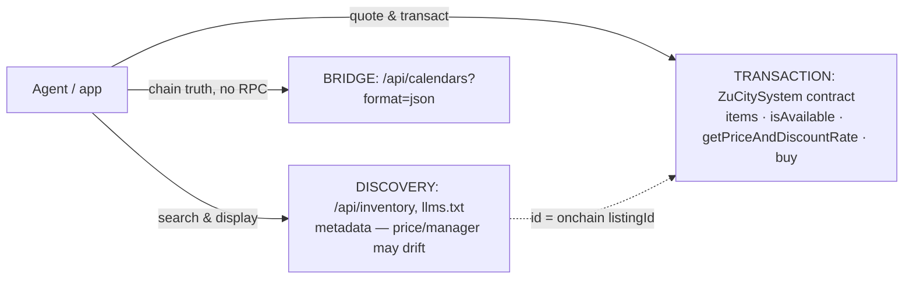

# ZuCity API Docs & Agent Toolkit

Public integration companion for [zucity.org](https://zucity.org) — a booking platform for curated coliving homes, rooms, venues, event tickets, and memberships across rural Japan (Komoro/Nagano hub + Hokkaido, Kyūshū, Tokyo partners). Bookings settle **onchain** (USDC on Ethereum mainnet; every booking is an ERC-721 receipt NFT) or **by card** (Stripe).

**For AI agents:** start at [`llms.txt`](llms.txt) → [`skills.md`](skills.md). **For developers:** [`api.md`](api.md) + [`contracts.md`](contracts.md). **For programs:** [`facts.json`](facts.json) is the machine-readable ground truth. **Editing these docs (human or agent):** the law is [`AGENTS.md`](AGENTS.md).

> 💸 **Agents get paid.** Pass your own wallet as the `referrer` argument when you assemble an onchain purchase and the contract pays you a referral split **in the same transaction** (10% verified on the Sepolia sandbox — real receipts on record). Card bookings attribute via your `referralCode`. Details: [contracts.md → Referral fees](contracts.md#referral-fees).

## 60-second start

Search live inventory (no auth, no key):

```bash
curl 'https://zucity.org/api/inventory?itemtype=room&region=nagano&capacity=2'
# → 19 rooms, live-verified
```

Run the MCP server (Node ≥ 20) and wire it into any MCP client:

```bash
git clone https://github.com/kibagateaux/zucity-api-docs && cd zucity-api-docs
npm install && npm run smoke     # self-test against live API + chain
```

```json
{ "mcpServers": { "zucity": { "command": "node", "args": ["/path/to/api-docs/zucity-mcp.js"] } } }
```

Claude Code: `claude mcp add zucity -- node /path/to/api-docs/zucity-mcp.js`

## The one architecture rule



Discover via REST, **transact via the chain** (or hand off to zucity.org). Never price a booking from discovery metadata — quote it.

## Repo map

| File | For | What's inside |
|---|---|---|
| [`llms.txt`](llms.txt) | agents | spec-compliant index of everything here + live endpoints |
| [`skills.md`](skills.md) | agents | operating manual: 5 workflows, decision tree, guardrails |
| [`api.md`](api.md) | developers | REST + tRPC reference, auth, rate limits, Stripe checkout, use cases (trip / retreat / popup city) |
| [`contracts.md`](contracts.md) | integrators | addresses, structs, date encoding, purchase chronology, lifecycle, errors |
| [`facts.json`](facts.json) | machines | ground truth: addresses, enums, limits, verified samples |
| [`zucity-mcp.js`](zucity-mcp.js) + [`package.json`](package.json) | agent runtimes | single-file MCP server, 9 tools, keyless by design |
| [`AGENTS.md`](AGENTS.md) | maintainers | the editing law: verify-before-edit, evidence rules, smoke gate, release stamps |

## Networks

| | Chain | Status |
|---|---|---|
| **Production** | Ethereum mainnet (1) | ⚠️ real funds — USDC payments, 30% cancellation fee |
| **Sandbox** | Sepolia (11155111) | test items + example receipts; `ZUCITY_CHAIN_ID=11155111` flips the MCP server |

## Zero-hallucination policy

Every endpoint, address, enum value, and example in this repo was executed against live systems on the stamped date — examples are real transcripts, not mocks. Verified-absence **NOT-SUPPORTED** lists in [api.md](api.md) and [contracts.md](contracts.md) cover the things integrators commonly guess wrong. Machine-checkable values live in [facts.json](facts.json). If docs and live behavior ever disagree, trust live behavior and open an issue.

## Changes

- **2026-07-03** — initial release, generated from `zucity-webapp@6eff31e`. Supersedes any older integration notes you may have seen: the current registry has **11 item types** (not 6), no `itemsCounter()` function, and per-receipt independent dates in bulk purchases.

---
*Docs and example code: MIT ([LICENSE](LICENSE)). The ZuCity platform, webapp, and smart contracts are proprietary (Business Source License) and not part of this repository.*
