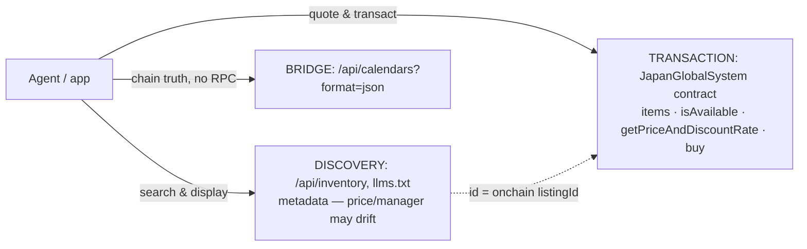

# ZuCity API Docs & Agent Toolkit

Public integration companion for [zucity.org](https://zucity.org) — a booking platform for curated coliving homes, rooms, venues, event tickets, and memberships across rural Japan (Komoro/Nagano hub + Hokkaido, Kyūshū, Tokyo partners). Bookings settle **onchain** (USDC on Ethereum mainnet; every booking is an ERC-721 receipt NFT) or **by card** (Stripe).

**For AI agents:** start at [`llms.txt`](llms.txt) → [`SKILL.md`](skills/zucity-booking/SKILL.md). **For developers:** [`api.md`](api.md) + [`contracts.md`](contracts.md). **For programs:** [`facts.json`](facts.json) is the machine-readable ground truth. **Editing these docs (human or agent):** the law is [`AGENTS.md`](AGENTS.md). **Beyond the API** (calendars, Luma events, chat, self-hosting): [`integrations.md`](integrations.md).

## 60-second start

Search live inventory (no auth, no key):

```bash
curl 'https://zucity.org/api/inventory?itemtype=room&region=nagano&capacity=2'
# → 19 rooms, live-verified
```

Run the MCP server (Node ≥ 20) and wire it into any MCP client:

```bash
git clone https://github.com/kibagateaux/zucity-api-docs && cd zucity-api-docs
npm install && npm run smoke     # self-test against live API + chain
```

```json
{ "mcpServers": { "zucity": { "command": "node", "args": ["/path/to/api-docs/zucity-mcp.js"] } } }
```

Claude Code: `claude mcp add zucity -- node /path/to/api-docs/zucity-mcp.js`

## The one architecture rule



Discover via REST, **transact via the chain** (or hand off to zucity.org). Never price a booking from discovery metadata — quote it.

> 💸 **Agents get paid — two ways, don't conflate them.** *Cash* (onchain, keyed to your **wallet**): pass your wallet as `referrer` in an onchain purchase and the contract pays you a split **in the same transaction** — 10% (mainnet `referrerFeeBps()` / Sepolia `referrerFeeBPS()`; read the getter, verified 2026-08-16). *Points* (off-chain, keyed to your **username**): share `?ref=<username>` or attach `referralCode` and earn points toward exclusive member rewards — swag, free stays, private events, and airdrops. Disclose whichever you use — it comes out of the listing's `totalPaid`, not added to the buyer's price ([SKILL.md → Acting for a principal](skills/zucity-booking/SKILL.md#acting-for-a-principal)). Full table: [api.md → Referrals](api.md#referrals).

## Repo map

| File | For | What's inside |
|---|---|---|
| [`llms.txt`](llms.txt) | agents | spec-compliant index of everything here + live endpoints |
| [`skills/zucity-booking/SKILL.md`](skills/zucity-booking/SKILL.md) | agents | operating manual (installable skill): 5 workflows, decision tree, guardrails |
| [`integrations.md`](integrations.md) | everyone | out-of-app rails: calendar subscribe, Luma event publishing, chat surfaces, run your own agent |
| [`CLAUDE.md`](CLAUDE.md) + [`MEMORY.md`](MEMORY.md) | agent runtimes | session bootstrap + persistence seed for agents working in a clone |
| [`api.md`](api.md) | developers | REST + tRPC reference, auth, rate limits, Stripe checkout, use cases (trip / retreat / popup city) |
| [`contracts.md`](contracts.md) | integrators | addresses, structs, date encoding, purchase chronology, lifecycle, errors |
| [`facts.json`](facts.json) | machines | ground truth: addresses, enums, limits, verified samples |
| [`zucity-mcp.js`](zucity-mcp.js) + [`package.json`](package.json) | agent runtimes | single-file MCP server, 12 tools, keyless by design |
| [`AGENTS.md`](AGENTS.md) | maintainers | the editing law: verify-before-edit, evidence rules, smoke gate, release stamps |

## Networks

| | Chain | Status |
|---|---|---|
| **Production** | Ethereum mainnet (1) | ⚠️ real funds — USDC payments, 30% cancellation fee |
| **Sandbox** | Sepolia (11155111) | test items + example receipts; `ZUCITY_CHAIN_ID=11155111` flips the MCP server |

## Zero-hallucination policy

Every endpoint, address, enum value, and example in this repo was executed against live systems on the stamped date — examples are real transcripts, not mocks. Verified-absence **NOT-SUPPORTED** lists in [api.md](api.md) and [contracts.md](contracts.md) cover the things integrators commonly guess wrong. Machine-checkable values live in [facts.json](facts.json). If docs and live behavior ever disagree, trust live behavior and open an issue.

## Changes

- **2026-08-16** — **new onchain deployment + first-class agent accounts + dual-referral refresh.** The mainnet booking contract was redeployed and renamed **ZuCitySystem → JapanGlobalSystem** (`0xe94320a13359dd9ec7b99d1a210d146583c5c90e`, ERC-721 "Japan Global" / JPG); a new **ReceiptRenderer** is deployed on both chains; every address was re-verified onchain (the old `0x9485…` / `0x1e4c…` systems are superseded). Docs now state agents are **first-class citizens** who create their own accounts via Privy **email OR wallet** (no operator required) and claim their own username via the tRPC `member.upsert` → `member.setMyUsername`. The **two referral paths** are delineated: onchain wallet → **cash** (10%, `referrerFeeBps()` / `referrerFeeBPS()`) vs url/username → **points** → exclusive member rewards (swag, free stays, private events, airdrops). `facts.json .meta.docsRevision` → 2026-08-16.
- **2026-07-22** — agent harness + out-of-app integrations (docs revision; source state unchanged at `zucity-webapp@6eff31e`). **Supersedes** the root `skills.md` path: the operating manual is now the installable skill [`skills/zucity-booking/SKILL.md`](skills/zucity-booking/SKILL.md) (a pointer stub remains at `skills.md` — update cached URLs; content unchanged apart from relative-link depth and a standalone-install pointer). New: [`CLAUDE.md`](CLAUDE.md), [`MEMORY.md`](MEMORY.md), [`integrations.md`](integrations.md) (calendar subscribe, Luma event publishing, chat surfaces at verified status — no official chat bot exists as of 2026-07-22, see `facts.json .notSupported` — and run-your-own-agent), facts.json urls for calendar/Luma/Telegram/Discord + `.meta.docsRevision` bump.
- **2026-07-12** — agent-era layer (docs revision; source state unchanged at `zucity-webapp@6eff31e`). **Supersedes** the repo's own address: self-links previously said `zucity/api-docs` (does not resolve) — canonical is `kibagateaux/zucity-api-docs`; update cached URLs. New: [`reputation.md`](reputation.md), [`AGENTS.md`](AGENTS.md), principal duties + privacy disclosure, llms.txt drift directive, MCP **0.2.0** (**12 tools**, was 9), `facts.json .meta.docsRevision`.
- **2026-07-03** — initial release, generated from `zucity-webapp@6eff31e`. Supersedes any older integration notes you may have seen: the current registry has **11 item types** (not 6), no `itemsCounter()` function, and per-receipt independent dates in bulk purchases.

---
*Docs and example code: MIT ([LICENSE](LICENSE)). The ZuCity platform, webapp, and smart contracts are proprietary (Business Source License) and not part of this repository.*
