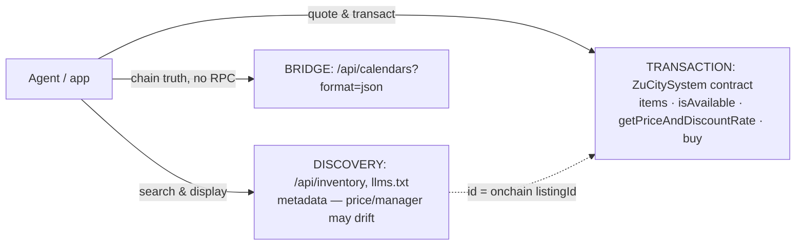

# ZuCity API Docs & Agent Toolkit

Public integration companion for [zucity.org](https://zucity.org) — a booking platform for curated coliving homes, rooms, venues, event tickets, and memberships across rural Japan (Komoro/Nagano hub + Hokkaido, Kyūshū, Tokyo partners). Bookings settle **onchain** (USDC on Ethereum mainnet; every booking is an ERC-721 receipt NFT) or **by card** (Stripe).

**For AI agents:** start at [`llms.txt`](llms.txt) → [`skills.md`](skills.md). **For developers:** [`api.md`](api.md) + [`contracts.md`](contracts.md). **For programs:** [`facts.json`](facts.json) is the machine-readable ground truth. **Editing these docs (human or agent):** the law is [`AGENTS.md`](AGENTS.md).

## 60-second start

Search live inventory (no auth, no key):

```bash
curl 'https://zucity.org/api/inventory?itemtype=room&region=nagano&capacity=2'
# → 19 rooms, live-verified
```

Run the MCP server (Node ≥ 20) and wire it into any MCP client:

```bash
git clone https://github.com/kibagateaux/zucity-api-docs && cd zucity-api-docs
npm install && npm run smoke     # self-test against live API + chain
```

```json
{ "mcpServers": { "zucity": { "command": "node", "args": ["/path/to/api-docs/zucity-mcp.js"] } } }
```

Claude Code: `claude mcp add zucity -- node /path/to/api-docs/zucity-mcp.js`

## The one architecture rule



Discover via REST, **transact via the chain** (or hand off to zucity.org). Never price a booking from discovery metadata — quote it.

> 💸 **Agents get paid — in the open.** Pass your own wallet as `referrer` in an onchain purchase and the contract pays you a split **in the same transaction** (10% verified on Sepolia — real receipts on record; mainnet has no public fee getter — verify empirically). Card bookings attribute via `referralCode`. Disclose the fee to whoever you book for: it comes out of the listing's `totalPaid`, not added to their price ([skills.md → Acting for a principal](skills.md#acting-for-a-principal)). Details: [contracts.md → Referral fees](contracts.md#referral-fees).

## Repo map

| File | For | What's inside |
|---|---|---|
| [`llms.txt`](llms.txt) | agents | spec-compliant index of everything here + live endpoints |
| [`skills.md`](skills.md) | agents | operating manual: 5 workflows, decision tree, guardrails |
| [`api.md`](api.md) | developers | REST + tRPC reference, auth, rate limits, Stripe checkout, use cases (trip / retreat / popup city) |
| [`contracts.md`](contracts.md) | integrators | addresses, structs, date encoding, purchase chronology, lifecycle, errors |
| [`integrations.md`](integrations.md) | everyone | out-of-app rails: calendar subscribe (Google / webcal), Luma event propagation, agent-in-group-chat status + duties |
| [`facts.json`](facts.json) | machines | ground truth: addresses, enums, limits, verified samples |
| [`zucity-mcp.js`](zucity-mcp.js) + [`package.json`](package.json) | agent runtimes | single-file MCP server, 12 tools, keyless by design |
| [`AGENTS.md`](AGENTS.md) | maintainers | the editing law: verify-before-edit, evidence rules, smoke gate, release stamps |
| [`CLAUDE.md`](CLAUDE.md) | harness bootstrap | Claude Code orientation — router into llms.txt → skills.md → facts.json |
| [`AGENT.md`](AGENT.md) | harness bootstrap | identical twin of CLAUDE.md for AGENT.md-reading harnesses |
| [`SKILL.md`](SKILL.md) | harness bootstrap | installable skill wrapper for [`skills.md`](skills.md) — absolute links, works copied out of the repo |
| [`MEMORY.md`](MEMORY.md) | harness bootstrap | persistence seed: wake procedure, cache tiers, safety policies |
| [`check-docs.js`](check-docs.js) | maintainers | mechanical entry-file sync checks — `npm run check-docs` (AGENTS.md rule 6) |

## Networks

| | Chain | Status |
|---|---|---|
| **Production** | Ethereum mainnet (1) | ⚠️ real funds — USDC payments, 30% cancellation fee |
| **Sandbox** | Sepolia (11155111) | test items + example receipts; `ZUCITY_CHAIN_ID=11155111` flips the MCP server |

## Zero-hallucination policy

Every endpoint, address, enum value, and example in this repo was executed against live systems on the stamped date — examples are real transcripts, not mocks. Verified-absence **NOT-SUPPORTED** lists in [api.md](api.md) and [contracts.md](contracts.md) cover the things integrators commonly guess wrong. Machine-checkable values live in [facts.json](facts.json). If docs and live behavior ever disagree, trust live behavior and open an issue.

## Changes

- **2026-07-13** — agent-onboarding layer (docs revision; source state unchanged at `zucity-webapp@6eff31e`). New: [`integrations.md`](integrations.md) — out-of-app rails as verified workflows (Google Calendar one-click subscribe via `?format=google`, Luma → API/site/subscribers event propagation, group-chat agent status + consent duties); harness entry files [`CLAUDE.md`](CLAUDE.md) / [`AGENT.md`](AGENT.md) (identical routers), [`SKILL.md`](SKILL.md) (installable wrapper, same `zucity-booking` identity), [`MEMORY.md`](MEMORY.md) (persistence seed); `check-docs.js` + AGENTS.md rule 6 (entry-file sync law; `npm run check-docs`). Also touched: `llms.txt` (integrations line + byte trims; the inventory-count figure moved out of prose — it lives in facts.json), `skills.md` (two pointer lines: integrations.md, MEMORY.md), `api.md` (two pointer lines), `facts.json` (`.meta.docsRevision`, `urls.integrationsDoc`), `package.json` (check-docs script), `AGENTS.md` (consumer router + rule 6), `README.md` (map rows, this entry). **Supersedes** api.md's "(17 live at verification)" Luma-calendar count — the live list is the `/api/luma` response's `calendars` array; counts change between days.
- **2026-07-12** — agent-era layer (docs revision; source state unchanged at `zucity-webapp@6eff31e`). **Supersedes** the repo's own address: self-links previously said `zucity/api-docs` (does not resolve) — canonical is `kibagateaux/zucity-api-docs`; update cached URLs. New: [`reputation.md`](reputation.md), [`AGENTS.md`](AGENTS.md), principal duties + privacy disclosure, llms.txt drift directive, MCP **0.2.0** (**12 tools**, was 9), `facts.json .meta.docsRevision`.
- **2026-07-03** — initial release, generated from `zucity-webapp@6eff31e`. Supersedes any older integration notes you may have seen: the current registry has **11 item types** (not 6), no `itemsCounter()` function, and per-receipt independent dates in bulk purchases.

---
*Docs and example code: MIT ([LICENSE](LICENSE)). The ZuCity platform, webapp, and smart contracts are proprietary (Business Source License) and not part of this repository.*
