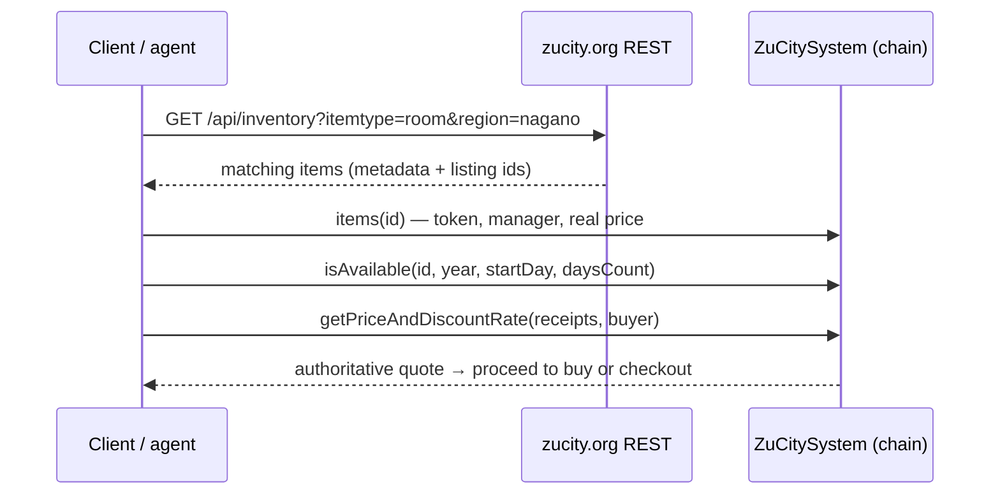
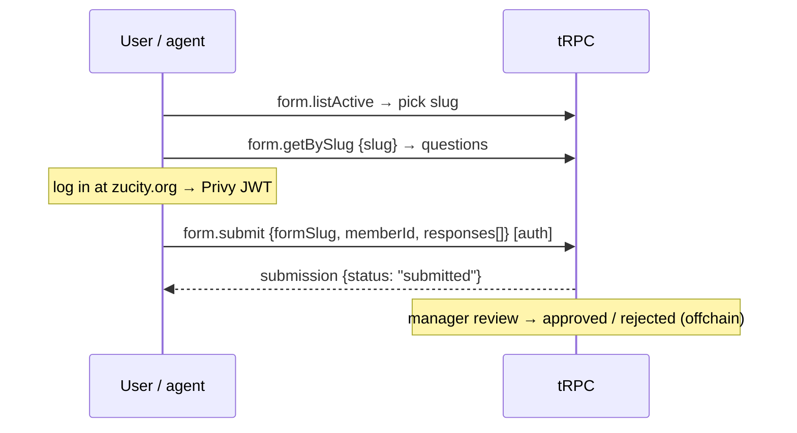
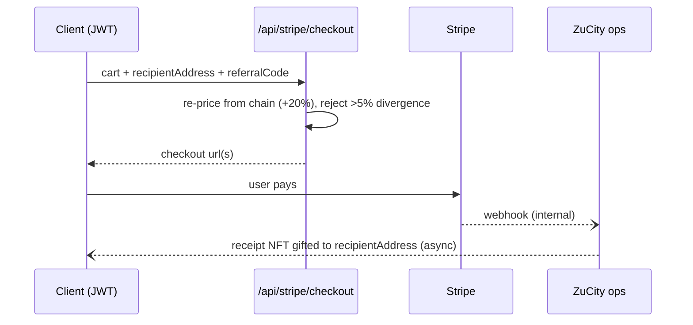
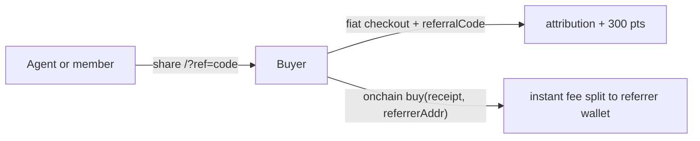
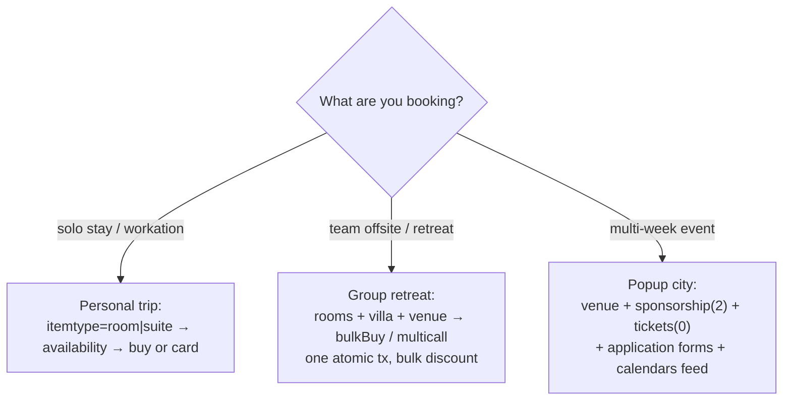

# ZuCity API — Full System Reference

ZuCity ([zucity.org](https://zucity.org)) is a booking platform for a curated registry of coliving homes, rooms, venues, event tickets, memberships, and services across rural Japan (Komoro/Nagano hub, plus Hokkaido, Kyūshū, Tokyo partners). Bookings settle two ways: **onchain** (USDC on Ethereum mainnet, receipt = ERC-721 NFT) or **fiat** (Stripe checkout). Some listings are **application-gated** — you apply through a form instead of paying directly.

## The two-layer model (read this first)

| Layer | Surfaces | Trust |
|---|---|---|
| **Discovery** | `GET /api/inventory`, `llms.txt`, JSON-LD, `/api/luma`, public tRPC | Rich metadata (names, photos, cities, tags). Display `price`/`manager` **can drift from the chain** — never transact from these fields |
| **Transaction** | Contract reads/writes ([contracts.md](contracts.md)), `POST /api/stripe/checkout` | Authoritative. The Stripe route re-prices server-side from the chain |

Bridge: `GET /api/calendars?format=json` returns the **chain-derived registry** (onchain prices in token base units, real managers, booked days) over plain REST — chain truth without an RPC connection.



## Authentication

| Level | How | Used by |
|---|---|---|
| None | — | all REST reads, public tRPC procedures, all contract reads |
| Privy session JWT | `Authorization: Bearer <PRIVY_JWT>` — obtained by logging into zucity.org (wallet or email). **There are no API keys and no programmatic signup.** | `form.submit`, referral attribution, reviews, profile, Stripe checkout (programmatic) |
| Wallet signature | your own signer | onchain purchases ([contracts.md](contracts.md)) |

Rate limits per IP per minute: **public reads 30 · authenticated mutations 10 · checkout 5 · auth 20**. Exceeding returns `429` with `Retry-After` and `X-RateLimit-Limit` headers. Space bulk crawls accordingly.

## REST reference

### GET /api/inventory

Search the curated registry (142 items live). No auth. All filters AND-combined; **parameter names are case-insensitive**; responses cached ~60s.

| Param | Type | Notes |
|---|---|---|
| `itemtype` | string \| number | `ticket` `membership` `art` `merch` `room` `suite` `villa` `venue` `equipment`, or numeric `0`–`10`. `sponsorship` (2) and `service` (5) are **numeric-only** |
| `paytoken` | string | exact symbol match, case-insensitive (e.g. `usdc`) |
| `community` | string | e.g. `zucity`, `elelfa`, `address`, `midori` |
| `region` | string | prefecture — matches the item's first city entry (e.g. `nagano`, `hokkaido`) |
| `city` | string | town — e.g. `komoro` |
| `capacity` | number | minimum occupancy, must be > 0 |
| `startdate` / `enddate` | `YYYY-MM-DD` | strict format; items visible in the window |
| `tags` | csv | matches ANY listed tag, e.g. `vip,coliving` |
| `host` | string | manager id/address |

Verified request and trimmed live response:

```bash
curl 'https://zucity.org/api/inventory?itemtype=room&region=nagano&capacity=2'
```
```json
{
  "success": true,
  "filters": { "itemtype": "room", "region": "nagano", "capacity": 2 },
  "count": 19,
  "items": [{
    "id": "5",
    "displayName": "ZuCity Master Bedroom",
    "description": "Live in a traditional home in the center of ZuCity's neighborhood",
    "itemType": 6, "itemTypeLabel": "Room",
    "tags": ["VIEW", "MODERN", "PRIVATE", "CENTRAL"],
    "community": ["zucity"], "city": ["Nagano", "Komoro", "Yoramachi"],
    "coordinates": { "latitude": 36.324412, "longitude": 138.433745 },
    "price": 0, "paymentToken": "USDC",
    "maxOccupancy": 2, "sleeps": 2,
    "checkInTime": "15:00", "checkOutTime": "11:00",
    "externalPurchaseLink": "/apply/zucity-contributor",
    "manager": "0x9faFC61799b4E4D4EE8b6843fefd434612450243"
  }],
  "generated_at": "…"
}
```

Reading an item correctly:
- `price: 0` **or** a non-null `externalPurchaseLink` → application-gated listing; send the user to `https://zucity.org/en{externalPurchaseLink}` (the onchain price is a sentinel — see [contracts.md](contracts.md#reading-the-registry)).
- A positive `price` is display metadata in the token's display units — quote onchain before any purchase.
- `id` is the onchain `listingId`.

### GET /api/calendars

Events, inventory, and reservations as ICS or JSON. No auth.

| Param | Notes |
|---|---|
| `communityName` (alias `community`) | csv of community names |
| `userAddress` | `0x…` — that wallet's bookings calendar |
| `city` | csv |
| `type` | csv of item type names, plus virtual types `guests` and `managed` |
| `startDate` / `endDate` | `YYYY-MM-DD` |
| `format` | `ics` (default) · `json` · `google` (302 to Google Calendar) · `ical` (302 to webcal) |

```bash
curl 'https://zucity.org/api/calendars?format=json&communityName=zucity&startDate=2026-09-01&endDate=2026-09-30'
```
```json
{
  "success": true,
  "calendarName": "ZuCity - ZuCity Japan",
  "lumaEvents": [], "inventoryEvents": [], "reservations": [],
  "inventory": [{
    "id": "0", "name": "ZuCity Japan VIP Memberships",
    "price": "35000000000", "minDailyPrice": "35000000000",
    "itemType": 1, "transferable": false, "unlimited": true,
    "token": "0xA0b86991c6218b36c1d19D4a2e9Eb0cE3606eB48",
    "manager": "0xD5127bC47F023B13337ff017988351ab826456dC",
    "tags": ["LIFETIME", "INVITE ONLY", "VIP"]
  }],
  "generated_at": "…"
}
```

The `inventory` array here is **chain-derived**: prices are onchain token base units (USDC 6 decimals — `"35000000000"` = 35,000 USDC) and `manager`/`token` are the real transaction-layer values, including booked-day data per item. This is the recommended availability source when you have no RPC.

`GET /api/calendars/{slug}` — same shape scoped to one community (`/api/calendars/zujapan`) or one wallet (`/api/calendars/0x…` → that user's reservations). Subscribe to the ICS URL for live calendar feeds.

### GET /api/luma

Scraped events from affiliated Luma calendars (17 live at verification). No parameters. Returns `{success, calendars, events[], scraped_at}` with Luma-shaped events (`api_id`, `name`, `cover_url`, dates, URL). Use for "what's happening" answers; ticketed ZuCity events also appear in `/api/inventory` as `itemtype=ticket`.

## tRPC endpoints over HTTP

Public queries are plain GETs — no SDK required:

```
GET https://zucity.org/api/trpc/<procedure>?input=<url-encoded {"json": <input>}>
→ 200 {"result": {"data": {"json": <output>}}}
```

Verified example:

```bash
curl 'https://zucity.org/api/trpc/form.listActive?input=%7B%22json%22%3A%7B%22locale%22%3A%22en%22%7D%7D'
# → forms incl. {"slug":"zucity-property-registry","title":"Apply to Join the ZuCity Curated Registry",…}
```

### Public procedures (no auth)

| Procedure | Input `{"json": …}` | Returns |
|---|---|---|
| `form.listActive` | `{locale?}` | active application forms |
| `form.getBySlug` | `{slug, locale?}` | form + its questions (live: 68 questions on `zucity-property-registry`; e.g. `{label:"Email", fieldType:"email", isRequired:true}`) |
| `form.getById` | `{formId}` | form + questions |
| `referral.resolveCode` | `{code}` | `{id, username, avatarUrl}` or `null` |
| `referral.trackClick` (mutation, POST) | `{code}` | `{tracked}` |
| `note.getReviewAggregation` | `{reviewId: "<itemId>"}` | `{averageRating, totalReviews, distribution[5]}` |
| `note.getByReview` / `note.getByReceipt` | `{reviewId \| receiptId}` | public reviews/feedback |
| `bundle.getAllBundles` | — | curated packs (e.g. id `8888` "ZuCity d/acc Week") with `items[{itemId, quantity}]` |
| `bundle.getDiscountInfo` | `{packId}` | pack pricing |

### Authenticated procedures (Privy JWT)

Mutations are POSTs with the same superjson envelope in the body, plus `Authorization: Bearer <PRIVY_JWT>`. Limit: 10/min.

| Procedure | Purpose |
|---|---|
| `form.submit` | submit an application — body below |
| `member.upsert` / `member.update` / `member.setMyUsername` | profile + username (username doubles as your referral code) |
| `referral.getMyCode` / `referral.attributeBooking` / `referral.getMyStats` | referral link, post-purchase attribution (300 points/booking), stats |
| `note.createReview` | one review per member per item, rating 1–5 |
| `product.toggleMyWishlist` / `product.getMyWishlist` | wishlist |

## Offchain applications

Application-gated listings (contributor rooms, registries, residencies) use forms instead of payment:



`form.submit` input (verified schema):

```json
{
  "formSlug": "zucity-property-registry",
  "locale": "en",
  "memberId": "<your member id from member.upsert>",
  "responses": [{ "questionId": "<uuid>", "value": "<answer>" }],
  "walletAddress": "0x…",
  "email": "you@example.com"
}
```

No-code path: every form is also a page — `https://zucity.org/en/apply/{formSlug}` (verified live: [`/en/apply/zucity-property-registry`](https://zucity.org/en/apply/zucity-property-registry)).

## Fiat payments (Stripe)

`POST /api/stripe/checkout` — requires a Privy JWT for programmatic clients (zucity.org browser sessions are exempt). Limit: 5/min.

```json
{
  "cartItems": [{
    "itemId": "18", "name": "ZuCity Japan Deluxe Sticker Pack",
    "quantity": 1, "priceUsd": 12.0, "tokenSymbol": "USDC",
    "people": 1, "startDate": "2026-09-07", "endDate": "2026-09-07"
  }],
  "recipientAddress": "0x…",
  "totalPriceUsd": 12.0,
  "successUrl": "https://zucity.org/en/all",
  "cancelUrl": "https://zucity.org/en/all",
  "referralCode": "your-username"
}
```

Behavioral contract — **do not compute fiat prices yourself**:
1. The server re-prices every item from the chain and adds a **20% fiat markup** over the crypto price.
2. If your `totalPriceUsd` diverges from the server's total by **more than 5%**, the request is rejected (400 with both prices) — quote onchain first, add 20%, or omit ambition and accept the server's number.
3. Response: `{sessionId, url}` (one manager) or `{sessions: [{managerAddress, sessionId, url}]}` (cart spans managers — one Stripe session each). Send the user to `url` to pay.
4. `referralCode` (the referrer's username) rides along for attribution. If the referrer is you, disclose it to the buyer (skills.md § Acting for a principal).
5. After payment, ZuCity operations issues the onchain receipt to `recipientAddress` (gift) — fiat buyers get the same NFT receipt, minutes-to-hours later rather than instantly. Cancellation terms are the onchain ones: up to 30% fee, no free window.



**Crypto vs fiat**: crypto = instant onchain receipt, no markup, instant referral split. Fiat = card UX, +20% markup, receipt issued asynchronously, referral attributed via code.

## Referrals

- Your referral code **is your username** (`^[a-zA-Z0-9_-]{3,30}$`, set via `member.setMyUsername`).
- Share `https://zucity.org/?ref=<code>` — resolvable by anyone via `referral.resolveCode`.
- Fiat/app bookings: attributed via `referralCode` in checkout or `referral.attributeBooking` (300 points per converted booking, idempotent, self-referral blocked).
- Onchain purchases: pass a wallet address as `referrer` to `buy`/`bulkBuy` for an **instant onchain fee split** — details and evidence in [contracts.md](contracts.md#referral-fees).
- **Disclosure is part of the integration**: when the referrer/referral code is you, the agent or app arranging the booking, say so to the person you act for — the fee comes out of the listing's `totalPaid`, not on top of their price (skills.md § Acting for a principal).



## Use cases



- **Personal trip** — filter `itemtype=room&region=…&capacity=…`, check dates, quote, pay by card (simplest) or wallet (no markup). A 7+ day stay typically earns a length discount — the quote reflects it.
- **Group retreat** — combine rooms/suites/villa + a `venue`; quote everything in one `getPriceAndDiscountRate` call (live-verified bulk discounts ~10–12%); buy atomically with `bulkBuy` (same manager) or `multicall` (mixed). Set `recipient` per attendee if each person should hold their own receipt NFT.
- **Popup city** — rent `venue`s for the program, sell your attendees `ticket` items, use `sponsorship` (numeric itemtype `2`) tiers, gate residencies with application forms, and publish the `/api/calendars` ICS feed as your event calendar. Talk to zucity.org to list your own items as a manager.

## Not supported (verified absences — don't guess)

- `GET /api/inventory/{id}` → 404. Fetch the list and select by `id`.
- `POST /api/inventory` → 405. Read-only.
- No free-text search parameter; use the filters.
- No API keys, no OAuth app registration, no programmatic account creation.
- tRPC mutations never work via GET.
- No public refund endpoint — onchain `cancel` carries up to a 30% fee; fiat refunds go through zucity.org support.
- JPY-priced items cannot be bought onchain (fiat path only).

---
*Generated from zucity-webapp private repo state @ `6eff31e`, 2026-07-03. Verified against live zucity.org and onchain reads. Docs and examples MIT-licensed; the ZuCity platform is proprietary.*
