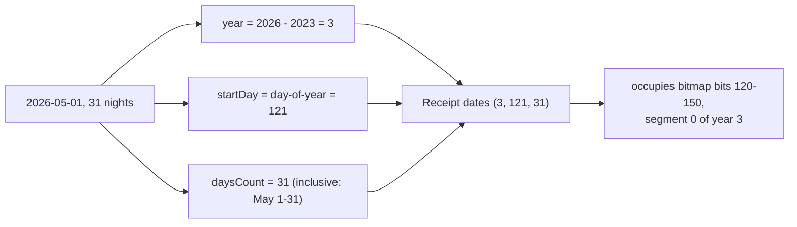
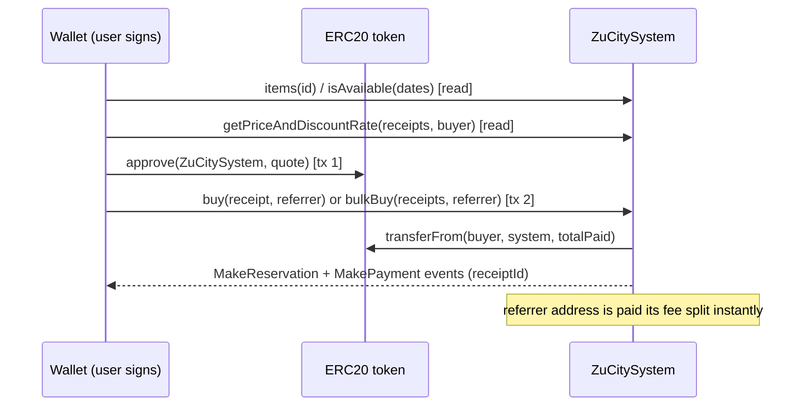
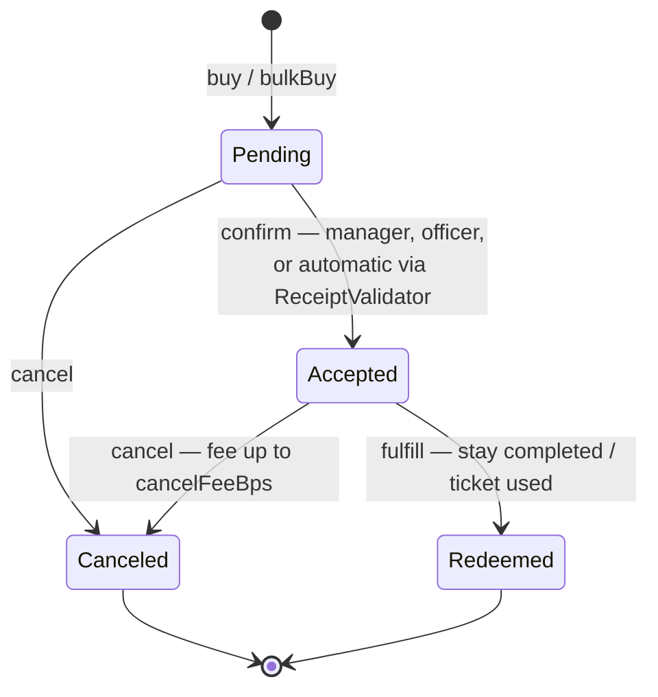

# ZuCity Smart Contract Integration

Everything needed to read inventory, check availability, quote prices, and buy bookings directly onchain. All values on this page were verified against the live deployments on 2026-07-03 — re-verify drift-prone numbers with the inline `cast` commands or the `get_facts` MCP tool.

The authority rule: **the chain is the transaction layer**. REST metadata ([api.md](api.md)) is for discovery only; its `price` and `manager` fields can drift from the contract. Always read `items()` and `getPriceAndDiscountRate()` before building a transaction.

## Chains and addresses

### Ethereum mainnet — production, REAL FUNDS

| Contract | Address |
|---|---|
| ZuCitySystem (booking system + ERC-721 receipts, "ZuCity Japan Network" / ZUJP) | `0x9485d36B0bD495c25b9F3b7c910649a1EE7d3b63` |
| ReceiptValidator (default; discounts + auto-confirm) | `0xdE7F0E8eeA39d015767E09f533E0f8628779348E` |
| Payment token — USDC (6 decimals) | `0xA0b86991c6218b36c1d19D4a2e9Eb0cE3606eB48` |

Each manager can run their own validator: `managerConfigs(manager) → address` is authoritative.

### Ethereum Sepolia — sandbox

| Contract | Address |
|---|---|
| ZuCitySystem | `0x1e4c242e1a5e1fff64512ce50673a1be4c5442df` |
| ReceiptValidator | `0x8e562f55c9bbfc6780e0846c63b8f941e1432c15` |
| Payment token — ZUJPTT (**8 decimals**) | `0xd920443209bA7d9B6d178021016AAfDCA88f8DfC` |
| Community token — ZUJPTT (8 decimals) | `0xdfda41669f7aa96586d6f00beb8c3fba795b26e7` |

Test your integration on Sepolia first. It holds 20 registry items and real example receipts (used throughout this page). Before signing anything, confirm the `chainId` in your transaction matches the table you took the address from.

## Enums

| ItemType | # | | ItemType | # |
|---|---|---|---|---|
| Ticket | 0 | | Service | 5 |
| Membership | 1 | | Room | 6 |
| Sponsorship | 2 | | Suite | 7 |
| Art | 3 | | Villa | 8 |
| Merch | 4 | | Venue | 9 |
| | | | Equipment | 10 |

| ReceiptStatus | # | Meaning |
|---|---|---|
| Pending | 0 | paid, awaiting confirmation |
| Accepted | 1 | confirmed — the receipt NFT is live |
| Canceled | 2 | terminal; refund minus cancel fee |
| Redeemed | 3 | terminal; stay/ticket was used |

## The Receipt struct

Used by `buy`, `bulkBuy`, `getPriceAndDiscountRate`, and returned by `receipts` / `allReceipts` — field order matters for encoding:

```
Receipt {
  uint64  listingId;    // registry item id (ids start at 0)
  uint8   status;       // always 0 (Pending) when buying
  uint8   year;         // calendarYear − 2023  (2026 → 3)
  uint16  startDay;     // 1-indexed day of year (Jan 1 = 1, max 364)
  uint8   daysCount;    // inclusive calendar days (1–255)
  uint128 totalPaid;    // quote amount on receipts[0] ONLY; 0 on all others
  address recipient;    // who receives the booking NFT
  uint128 referrerFee;  // set 0; the contract fills it
  address token;        // payment token from items(listingId)
}
```

`isAvailable` takes the smaller `ReceiptDates` tuple: `(uint64 listingId, uint8 year, uint16 startDay, uint8 daysCount)`.

## How dates are encoded



- `year` = calendar year − 2023. `startDay` is the 1-indexed day of the calendar year. `daysCount` counts calendar days inclusively — a stay occupying May 1–31 is `daysCount = 31`, and the next stay can start June 1 (day 152).
- The 364-day contract year is stored as two 182-day bitmaps per item: `segment = floor((startDay − 1) / 182)`, `bit = (startDay − 1) % 182`, bit set = booked. Storage key: `keccak256(abi.encodePacked(uint64 listingId, uint8 year, uint256 segment))`.
- Stays crossing December 31 are supported — occupancy wraps into `(year + 1, segment 0)`.
- **Verified live**: Sepolia receipt id 2 (item 3, `year=3, startDay=121, daysCount=31`) sets exactly bits 120–150 of segment 0, and `isAvailable(3,3,121,1)` returns `false` while day 120 and day 152 return `true`.

You rarely need the bitmap directly — `isAvailable()` is the canonical check, and [`/api/calendars?format=json`](api.md#get-apicalendars) serves booked days over REST. Raw bitmap reads are only for indexers.

## Reading the registry

```
items(uint64 id) → (uint128 minUnitPrice, uint8 itemType, bool transferable, bool unlimited, address token, address manager)
allItems(uint64 idStartIndex, address manager, uint8 itemType, uint8 year, uint16 segmentCount) → ItemDisplayData[]
```

- Item ids start at **0**. There is **no `itemsCounter()`** — enumerate with `allItems` (use `manager = 0x0` and `itemType = 255` for no filter) or via the REST bridge.
- `unlimited = true` items (tickets, memberships) never run out of availability; buy one receipt per seat/person.
- **Sentinel price**: `minUnitPrice == 2^128 − 2` (`340282366920938463463374607431768211454`) means the item is **application-gated** — it cannot be bought directly. Route the user to the item's `externalPurchaseLink` / the [application flow](api.md#offchain-applications) instead.
- Live mainnet items with real prices (2026-07-03): id 1 = 50 USDC, 2 = 200, 3 = 500, 4 = 500, 12 = 60, 15 = 60, 18 = 10, 20 = 8 (per unit-day, 6-decimal base units).

```bash
cast call 0x9485d36B0bD495c25b9F3b7c910649a1EE7d3b63 \
  "items(uint64)(uint128,uint8,bool,bool,address,address)" 18 \
  --rpc-url https://ethereum-rpc.publicnode.com
# → 10000000, 4, false, false, 0xA0b86991…eB48, 0xD5127bC4…6dC   (10 USDC, Merch)
```

## Checking availability

```
isAvailable((uint64 listingId, uint8 year, uint16 startDay, uint8 daysCount)) → bool
```

```bash
cast call 0x9485d36B0bD495c25b9F3b7c910649a1EE7d3b63 \
  "isAvailable((uint64,uint8,uint16,uint8))(bool)" "(5,3,250,4)" \
  --rpc-url https://ethereum-rpc.publicnode.com
# → true   (item 5, Sep 7 2026, 4 days)
```

## Quoting the price

```
getPriceAndDiscountRate(Receipt[] b, address buyer) → (uint256 totalPrice, uint256 discountRateBps)
```

Pass fully-formed receipts with `totalPaid = 0`. Discounts (bulk, stay length, community standing) are computed by the manager's ReceiptValidator — **never hardcode discount math; this call is the only authoritative price.** Live-verified examples (mainnet, buyer with no special standing):

| Quote | Result |
|---|---|
| item 18, 1 day | `(9950000, 50)` → 9.95 USDC, 0.5% discount |
| items 18 + 20, same day | `(16038000, 1090)` → 16.038 USDC, 10.9% bulk discount |
| item 18 × 1 day + item 20 × 3 days (mixed durations — supported) | `(29988000, 1180)` → 29.988 USDC, 11.8% discount |

## Buying — exact chronological order



1. **Read** `items(listingId)` for `token`, `manager`, `unlimited`, and the sentinel check.
2. **Check** `isAvailable(dates)` for each non-unlimited item.
3. **Quote** with `getPriceAndDiscountRate(receipts, buyer)`.
4. **Approve**: `token.approve(ZuCitySystem, quote)` (one approval per distinct token).
5. **Set `totalPaid = quote` on `receipts[0]` only** — all other receipts keep `totalPaid = 0`.
6. **Execute**:

| Situation | Call |
|---|---|
| one item, one manager | `buy(receipt, referrer) → (totalPaid, receiptId)` |
| several items, one manager | `bulkBuy(receipts, referrer) → (price, receiptIds[])` — all receipts must share the same manager **and the same payment token**; per-receipt independent dates are fine |
| items from several managers | encode one `buy`/`bulkBuy` per manager group and batch them in `multicall(bytes[])` — one signature, atomic |

7. **Record the receipt ids** from the `MakeReservation` events in the transaction logs.

The `referrer` argument may be any wallet address (use `0x0` for none) — see [Referral fees](#referral-fees).

## Receipt lifecycle



- Receipts are **ERC-721 NFTs** ("ZuCity Japan Network", ZUJP): once Accepted, `ownerOf(receiptId)` is the guest; the booking is provable and (where `transferable`) transferable.
- **Receipts are public.** A receipt exposes its recipient wallet, listing, dates, and amount to anyone (`/api/calendars/{wallet}` serves any wallet's bookings over REST). Buying for a user? Say so, and choose the `recipient` address deliberately — a dedicated wallet decouples stays from a primary identity. No private-booking mode exists today.
- Buyers who pass the manager's ReceiptValidator are confirmed automatically in the same transaction; otherwise the receipt stays `Pending` until the manager confirms.
- **Cancellation costs up to `cancelFeeBps()` — currently `3000` (30%) on both chains.** The refund returns to the recipient in the payment token. There is no fee-free cancellation window onchain; confirm plans before buying.
- Track your bookings: `receipts(id)`, `allReceipts(0, [0xFFFFFFFFFFFFFFFF], yourAddress, 255)` (max-sentinel filters mean "all items / all statuses"), or over REST via `/api/calendars/{yourAddress}?format=json`.

## Referral fees

`buy` and `bulkBuy` accept a `referrer` address. When set, the contract pays the referrer a fee split from `totalPaid` **in the same transaction** and records it in the receipt's `referrerFee` field.

- **Verified on Sepolia**: `referrerFeeBPS() = 1000` (10%), and live receipts 0 and 2 each record exactly 10% of `totalPaid` as `referrerFee`.
- The mainnet deployment does not expose a public fee getter — verify the current mainnet split empirically (read `receipts(id).referrerFee` after a small purchase) rather than assuming a number.
- This is the agent monetization hook: pass **your own wallet** as `referrer` when assembling purchases for users. No registration required.
- **Disclose the fee to whoever you buy for.** It is paid out of `totalPaid` — `getPriceAndDiscountRate` takes no referrer argument, so the split does not change the buyer's quote. Disclosure is an integration requirement (SKILL.md § Acting for a principal).

## Events (for indexing)

| Event | Signature |
|---|---|
| MakeReservation | `(uint256 receiptId, uint64 listingId, address recipient, uint8 year, uint16 startDay, uint8 daysCount)` |
| MakePayment | `(uint256 receiptId, uint64 itemId, address referrer, uint256 minPurchasePrice, uint256 totalBidPrice, uint256 parentReceipt)` |
| ConfirmReservation | `(uint256 receiptId, address recipient, address caller)` |
| CancelReservation | `(uint256 receiptId, address recipient, address canceler, uint256 refund, uint256 cancelFee)` |
| Fulfill | `(uint256 receiptId, address recipient)` |

## Errors you can hit as a buyer

| Error | Cause / fix |
|---|---|
| `ItemAlreadyReserved` | dates taken — re-check `isAvailable` |
| `InvalidReceiptDate` / `InvalidReceiptLength` / `YearOutOfRange` | bad `startDay` (must be 1–364), `daysCount = 0`, or year encoding |
| `InvalidGuest` | `recipient = 0x0` |
| `ItemNeedsPrice` | sentinel-priced item — use the application flow |
| `InvalidBulkPayment` | `totalPaid` set on a receipt other than `receipts[0]` |
| `MixedManagers` / `MixedPaymentTokens` | split into per-manager, per-token `bulkBuy` calls under `multicall` |
| `ReceiptAlreadyConfirmedOrCanceled` / `ReceiptAlreadyFinalized` | acting on a terminal receipt |
| `RecipientBan` / `ManagerBanned` | account restricted — contact zucity.org |
| `Unauthorized` | calling a manager-only function (`confirm`, `fulfill` are not buyer calls) |

## Not supported / common wrong guesses

- No `itemsCounter()` — enumerate via `allItems` or REST.
- No public refund/dispute API — `cancel(receiptId)` with the 30% max fee is the only self-serve path.
- Paying with ETH is not a thing — all payments are ERC20 (`approve` first).
- JPY-priced listings are fiat-only (the JPY token address is a placeholder, not a deployed ERC20).
- `confirm`, `fulfill`, `gift`, and item listing are manager/operator functions — documented here only so you can interpret receipt states.

---
*Generated from zucity-webapp private repo state @ `6eff31e`, 2026-07-03. Verified against live zucity.org and onchain reads. Docs and examples MIT-licensed; the ZuCity platform and contracts are proprietary.*
