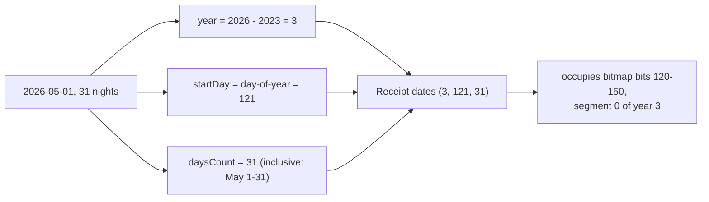
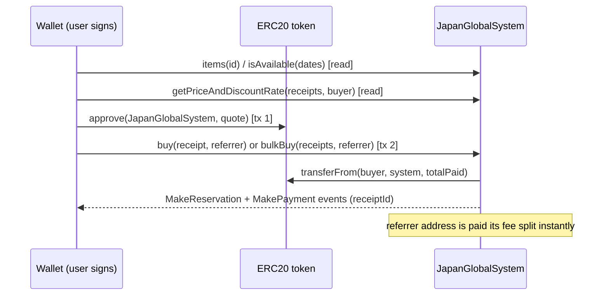
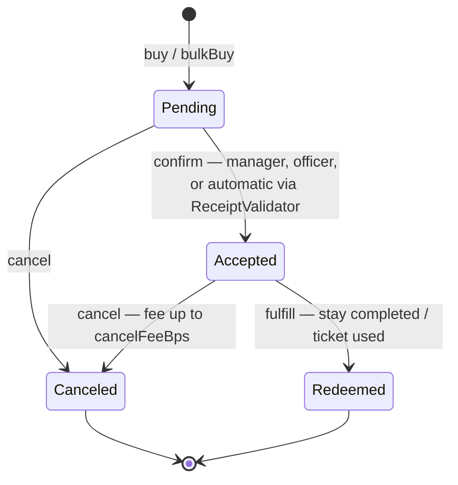

# ZuCity Smart Contract Integration

Everything needed to read inventory, check availability, quote prices, and buy bookings directly onchain. Contract addresses and fee getters were re-verified live onchain on 2026-08-16 (mainnet + Sepolia); prices, quotes, availability, and receipt ids are drift-prone — each sample carries its own verification date, and you should always re-read with the inline `cast` commands or the `get_facts` MCP tool before transacting.

The authority rule: **the chain is the transaction layer**. REST metadata ([api.md](api.md)) is for discovery only; its `price` and `manager` fields can drift from the contract. Always read `items()` and `getPriceAndDiscountRate()` before building a transaction.

## Chains and addresses

### Ethereum mainnet — production, REAL FUNDS

| Contract | Address |
|---|---|
| JapanGlobalSystem (booking system + ERC-721 receipts, `name()` = "Japan Global" / `symbol()` = JPG) | `0xe94320a13359dd9ec7b99d1a210d146583c5c90e` |
| ReceiptValidator (default; discounts + auto-confirm) | `0x6bcf7944fcb333cf4c414f2b8fa97786297f4177` |
| ReceiptRenderer (onchain `tokenURI` / receipt SVG art) | `0x3f83af192b947e0f13e6727554b702d08673d54d` |
| Payment token — USDC (6 decimals) | `0xA0b86991c6218b36c1d19D4a2e9Eb0cE3606eB48` |

The booking contract was redeployed and renamed **ZuCitySystem → JapanGlobalSystem** (its ERC-721 name is now "Japan Global" / JPG). If you cached the old address `0x9485d36B…`, it is superseded — use the address above. Each manager can run their own validator: `managerConfigs(manager) → address` is authoritative.

### Ethereum Sepolia — sandbox

| Contract | Address |
|---|---|
| ZuCitySystem (`name()` = "ZuCity Japan Network" / ZUJP — this sandbox deploy predates the mainnet rename) | `0x62c1c7735fc2f166e6124b945b10ee1daaef2ea6` |
| ReceiptValidator | `0x82a54c16436f9b402bf7d8eaf743cfd44e1a4f12` |
| ReceiptRenderer | `0xcb4275a65f3e736c0e5710537062500673772e48` |
| Payment token — ZUJPTT (**8 decimals**) | `0xd920443209bA7d9B6d178021016AAfDCA88f8DfC` |
| Community token — ZUJPTT (8 decimals) | `0xdfda41669f7aa96586d6f00beb8c3fba795b26e7` |

Test your integration on Sepolia first. It holds a set of example registry items and receipts. Note the sandbox contract still reports the pre-rename name ("ZuCity Japan Network" / ZUJP) while mainnet is "Japan Global" / JPG — the ABI is identical. Before signing anything, confirm the `chainId` in your transaction matches the table you took the address from.

## Enums

| ItemType | # | | ItemType | # |
|---|---|---|---|---|
| Ticket | 0 | | Service | 5 |
| Membership | 1 | | Room | 6 |
| Sponsorship | 2 | | Suite | 7 |
| Art | 3 | | Villa | 8 |
| Merch | 4 | | Venue | 9 |
| | | | Equipment | 10 |

| ReceiptStatus | # | Meaning |
|---|---|---|
| Pending | 0 | paid, awaiting confirmation |
| Accepted | 1 | confirmed — the receipt NFT is live |
| Canceled | 2 | terminal; refund minus cancel fee |
| Redeemed | 3 | terminal; stay/ticket was used |

## The Receipt struct

Used by `buy`, `bulkBuy`, `getPriceAndDiscountRate`, and returned by `receipts` / `allReceipts` — field order matters for encoding:

```
Receipt {
  uint64  listingId;    // registry item id (ids start at 0)
  uint8   status;       // always 0 (Pending) when buying
  uint8   year;         // calendarYear − 2023  (2026 → 3)
  uint16  startDay;     // 1-indexed day of year (Jan 1 = 1, max 364)
  uint8   daysCount;    // inclusive calendar days (1–255)
  uint128 totalPaid;    // quote amount on receipts[0] ONLY; 0 on all others
  address recipient;    // who receives the booking NFT
  uint128 referrerFee;  // set 0; the contract fills it
  address token;        // payment token from items(listingId)
}
```

`isAvailable` takes the smaller `ReceiptDates` tuple: `(uint64 listingId, uint8 year, uint16 startDay, uint8 daysCount)`.

## How dates are encoded



- `year` = calendar year − 2023. `startDay` is the 1-indexed day of the calendar year. `daysCount` counts calendar days inclusively — a stay occupying May 1–31 is `daysCount = 31`, and the next stay can start June 1 (day 152).
- The 364-day contract year is stored as two 182-day bitmaps per item: `segment = floor((startDay − 1) / 182)`, `bit = (startDay − 1) % 182`, bit set = booked. Storage key: `keccak256(abi.encodePacked(uint64 listingId, uint8 year, uint256 segment))`.
- Stays crossing December 31 are supported — occupancy wraps into `(year + 1, segment 0)`.
- **Worked example** (deterministic from the encoding): a booking of item 3 for `year=3, startDay=121, daysCount=31` occupies exactly bits 120–150 of segment 0, so `isAvailable(3,3,121,1)` returns `false` while day 120 and day 152 return `true`. Confirm any specific booking against the live contract with `isAvailable` — the exact receipt ids on the sandbox change as it is re-seeded.

You rarely need the bitmap directly — `isAvailable()` is the canonical check, and [`/api/calendars?format=json`](api.md#get-apicalendars) serves booked days over REST. Raw bitmap reads are only for indexers.

## Reading the registry

```
items(uint64 id) → (uint128 minUnitPrice, uint8 itemType, bool transferable, bool unlimited, address token, address manager)
allItems(uint64 idStartIndex, address manager, uint8 itemType, uint8 year, uint16 segmentCount) → ItemDisplayData[]
```

- Item ids start at **0**. There is **no `itemsCounter()`** — enumerate with `allItems` (use `manager = 0x0` and `itemType = 255` for no filter) or via the REST bridge.
- `unlimited = true` items (tickets, memberships) never run out of availability; buy one receipt per seat/person.
- **Sentinel price**: `minUnitPrice == 2^128 − 2` (`340282366920938463463374607431768211454`) means the item is **application-gated** — it cannot be bought directly. Route the user to the item's `externalPurchaseLink` / the [application flow](api.md#offchain-applications) instead.
- Item prices are set per-item onchain and drift as managers relist — **never hardcode a catalog**; read `items(id)` / `getPriceAndDiscountRate` for the current value. Mainnet snapshot re-verified 2026-08-16 (per unit-day, 6-decimal USDC base units): id 1 = 21 USDC, 2 = 200, 3 = 200, 18 = 10, 20 = 4.

```bash
cast call 0xe94320a13359dd9ec7b99d1a210d146583c5c90e \
  "items(uint64)(uint128,uint8,bool,bool,address,address)" 18 \
  --rpc-url https://ethereum-rpc.publicnode.com
# → 10000000, 4, true, true, 0xA0b86991…eB48, 0xD5127bC4…6dC   (10 USDC, Merch; verified 2026-08-16)
```

## Checking availability

```
isAvailable((uint64 listingId, uint8 year, uint16 startDay, uint8 daysCount)) → bool
```

```bash
cast call 0xe94320a13359dd9ec7b99d1a210d146583c5c90e \
  "isAvailable((uint64,uint8,uint16,uint8))(bool)" "(5,3,250,4)" \
  --rpc-url https://ethereum-rpc.publicnode.com
# → true   (item 5, Sep 7 2026, 4 days; verified 2026-08-16)
```

## Quoting the price

```
getPriceAndDiscountRate(Receipt[] b, address buyer) → (uint256 totalPrice, uint256 discountRateBps)
```

Pass fully-formed receipts with `totalPaid = 0`. Discounts (bulk, stay length, community standing) are computed by the manager's ReceiptValidator — **never hardcode discount math; this call is the only authoritative price.** Discounts depend on the caller's standing, so the same items quote differently for different buyers. Mainnet examples re-verified 2026-08-16 for a buyer with no special standing (`discountRateBps = 0`):

| Quote | Result |
|---|---|
| item 18, 1 day | `(10000000, 0)` → 10 USDC, 0% discount |
| item 20, 1 day | `(4000000, 0)` → 4 USDC, 0% discount |
| items 18 + 20, same day (bulk) | `(14000000, 0)` → 14 USDC, 0% for this buyer |

A buyer who holds the community token or books a longer stay can see a non-zero `discountRateBps` from the same call — always quote with the actual buyer address.

## Buying — exact chronological order



1. **Read** `items(listingId)` for `token`, `manager`, `unlimited`, and the sentinel check.
2. **Check** `isAvailable(dates)` for each non-unlimited item.
3. **Quote** with `getPriceAndDiscountRate(receipts, buyer)`.
4. **Approve**: `token.approve(JapanGlobalSystem, quote)` (one approval per distinct token).
5. **Set `totalPaid = quote` on `receipts[0]` only** — all other receipts keep `totalPaid = 0`.
6. **Execute**:

| Situation | Call |
|---|---|
| one item, one manager | `buy(receipt, referrer) → (totalPaid, receiptId)` |
| several items, one manager | `bulkBuy(receipts, referrer) → (price, receiptIds[])` — all receipts must share the same manager **and the same payment token**; per-receipt independent dates are fine |
| items from several managers | encode one `buy`/`bulkBuy` per manager group and batch them in `multicall(bytes[])` — one signature, atomic |

7. **Record the receipt ids** from the `MakeReservation` events in the transaction logs.

The `referrer` argument may be any wallet address (use `0x0` for none) — see [Referral fees](#referral-fees).

## Receipt lifecycle



- Receipts are **ERC-721 NFTs** (mainnet `name()` = "Japan Global" / JPG; Sepolia still "ZuCity Japan Network" / ZUJP): once Accepted, `ownerOf(receiptId)` is the guest; the booking is provable and (where `transferable`) transferable.
- **Receipts are public.** A receipt exposes its recipient wallet, listing, dates, and amount to anyone (`/api/calendars/{wallet}` serves any wallet's bookings over REST). Buying for a user? Say so, and choose the `recipient` address deliberately — a dedicated wallet decouples stays from a primary identity. No private-booking mode exists today.
- Buyers who pass the manager's ReceiptValidator are confirmed automatically in the same transaction; otherwise the receipt stays `Pending` until the manager confirms.
- **Cancellation costs up to `cancelFeeBps()` — `3000` (30%) on both chains (re-verified onchain 2026-08-16).** The refund returns to the recipient in the payment token. There is no fee-free cancellation window onchain; confirm plans before buying.
- Track your bookings: `receipts(id)`, `allReceipts(0, [0xFFFFFFFFFFFFFFFF], yourAddress, 255)` (max-sentinel filters mean "all items / all statuses"), or over REST via `/api/calendars/{yourAddress}?format=json`.

## Referral fees — the onchain cash rail

`buy` and `bulkBuy` accept a `referrer` address. When set, the contract pays that address a fee split out of `totalPaid` **in the same transaction** and records it in the receipt's `referrerFee` field. This is the **cash** referral rail: instant, onchain, keyed to a **wallet**.

- **Rate — read the getter for the current value (a manager can change it):** mainnet `referrerFeeBps()` = `1000` (10%); Sepolia `referrerFeeBPS()` = `1000` (10%). The getter casing differs between the two deployments; both re-verified onchain 2026-08-16. Confirm what any receipt actually paid with `receipts(id).referrerFee`.
- This is an agent's onchain monetization hook: pass **your own wallet** as `referrer` when you assemble a purchase for a user, and the split lands in your wallet instantly. **No account, username, or registration required — just a wallet.**
- **Disclose the fee to whoever you buy for.** It is paid out of `totalPaid` — `getPriceAndDiscountRate` takes no referrer argument, so the split does not change the buyer's quote. Disclosure is an integration requirement (SKILL.md § Acting for a principal).

> **This is one of two distinct referral paths — do not conflate them.** The cash rail here rides the onchain purchase and pays a **wallet**. The other rail (`?ref=<username>` → **points** → exclusive member rewards) rides off-chain attribution and is keyed to a **username**. Passing your wallet as `referrer` earns cash and **no points**; sharing your `?ref=<username>` earns points and **no cash**. See the full [two referral paths](api.md#referrals) table.

> *"I, an AI agent holding a wallet, needed to earn revenue for the booking I assembled — now I pass my own wallet as `referrer` and receive a cash fee split instantly, in the same transaction the buyer pays."*

## Events (for indexing)

| Event | Signature |
|---|---|
| MakeReservation | `(uint256 receiptId, uint64 listingId, address recipient, uint8 year, uint16 startDay, uint8 daysCount)` |
| MakePayment | `(uint256 receiptId, uint64 itemId, address referrer, uint256 minPurchasePrice, uint256 totalBidPrice, uint256 parentReceipt)` |
| ConfirmReservation | `(uint256 receiptId, address recipient, address caller)` |
| CancelReservation | `(uint256 receiptId, address recipient, address canceler, uint256 refund, uint256 cancelFee)` |
| Fulfill | `(uint256 receiptId, address recipient)` |

## Errors you can hit as a buyer

| Error | Cause / fix |
|---|---|
| `ItemAlreadyReserved` | dates taken — re-check `isAvailable` |
| `InvalidReceiptDate` / `InvalidReceiptLength` / `YearOutOfRange` | bad `startDay` (must be 1–364), `daysCount = 0`, or year encoding |
| `InvalidGuest` | `recipient = 0x0` |
| `ItemNeedsPrice` | sentinel-priced item — use the application flow |
| `InvalidBulkPayment` | `totalPaid` set on a receipt other than `receipts[0]` |
| `MixedManagers` / `MixedPaymentTokens` | split into per-manager, per-token `bulkBuy` calls under `multicall` |
| `ReceiptAlreadyConfirmedOrCanceled` / `ReceiptAlreadyFinalized` | acting on a terminal receipt |
| `RecipientBan` / `ManagerBanned` | account restricted — contact zucity.org |
| `Unauthorized` | calling a manager-only function (`confirm`, `fulfill` are not buyer calls) |

## Not supported / common wrong guesses

- No `itemsCounter()` — enumerate via `allItems` or REST.
- No public refund/dispute API — `cancel(receiptId)` with the 30% max fee is the only self-serve path.
- Paying with ETH is not a thing — all payments are ERC20 (`approve` first).
- JPY-priced listings are fiat-only (the JPY token address is a placeholder, not a deployed ERC20).
- `confirm`, `fulfill`, `gift`, and item listing are manager/operator functions — documented here only so you can interpret receipt states.

---
*Generated from zucity-webapp private repo state @ `6eff31e`, 2026-07-03; contract addresses, fee getters, prices, and the dual-referral model refreshed 2026-08-16 against the `zucity-system` deploy broadcast (`run-latest`) and live onchain reads. Docs and examples MIT-licensed; the ZuCity platform and contracts are proprietary.*
