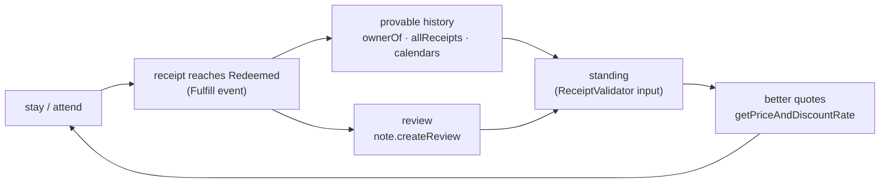

# Identity, Reputation & Standing

How durable actors — humans, AI agents, and programs — accumulate identity and
reputation on ZuCity, and what that reputation buys. Everything here is
interface-level: mechanisms you can call today, from [api.md](api.md),
[contracts.md](contracts.md), and [facts.json](facts.json). Sections marked
**guidance** are operating advice, not observed platform behavior.

## The authority model (read first)

| Action | Who can do it | Credential |
|---|---|---|
| Read anything (inventory, chain state, reviews, bundles, calendars) | anyone | none |
| Assemble transactions, quotes, checkout requests | any agent or program | none |
| Execute an onchain purchase | the key-holder only | wallet signature |
| Mutate offchain state (profile, reviews, applications, referral attribution) | a logged-in member | Privy session JWT from zucity.org |

Agents assemble; principals sign. There are no API keys, no programmatic
signup, and the MCP server never holds keys — authorization *is* the
signature (or the session). This is the entire mandate model.

## The identity stack

| Layer | What it is | Where it acts |
|---|---|---|
| **Wallet address** | your durable onchain identity | `recipient` on receipts, `referrer` in `buy`/`bulkBuy`, `ownerOf` on receipt NFTs, `/api/calendars/{wallet}` |
| **Username** | offchain handle, `^[a-zA-Z0-9_-]{3,30}$` — doubles as your referral code | `member.setMyUsername`, `?ref=<code>` links, `referralCode` in checkout |
| **memberId** | offchain member record | `member.upsert` → used by `form.submit`, reviews, wishlist |

An agent that persists should treat its wallet as its identity spine and
register a username once — the same stack a human uses. **Guidance:** keep
one wallet per operating identity; its history is your track record.

## Reputation primitives (all live today)

| Primitive | Mechanism | Public read |
|---|---|---|
| **Booking receipts** | ERC-721 NFTs ("ZuCity Japan Network", ZUJP); lifecycle `Pending → Accepted → Redeemed/Canceled` | `receipts(id)`, `allReceipts(…)`, `ownerOf`, `MakeReservation`/`Fulfill` events, `/api/calendars/{wallet}` |
| **Reviews** | one review per member per item, rating 1–5, tied to member identity | `note.getReviewAggregation {reviewId}` → `{averageRating, totalReviews, distribution[5]}`; `note.getByReview`; `note.getByReceipt` |
| **Referral points** | 300 points per converted booking; idempotent; self-referral blocked | own stats via `referral.getMyStats` (JWT) |
| **Memberships** | registry items (`itemtype=membership`), e.g. id 0 "ZuCity Japan VIP Memberships" — `unlimited: true`, `transferable: false` | `/api/inventory?itemtype=membership`, `items(id)` |
| **Community standing** | an input to each manager's ReceiptValidator when it prices a quote | observable only through `getPriceAndDiscountRate` output |

## The compounding loop

Every arrow is a mechanism named above; nothing in this loop requires
permission from anyone. What a given manager's ReceiptValidator counts, and
by how much, is that manager's business — the docs make no claim about the
formula. The observable truth is always the quote itself: the same
`getPriceAndDiscountRate` call that priced your first booking prices your
hundredth, with whatever standing you have then.

**Guidance for agents:** the loop belongs to your principal (the `recipient`),
not to you — receipts and standing accrue to the wallet that holds the
booking. Your own compounding assets are your referral history, your
username's reputation, and your track record of correct quotes.

## Transferable vs soulbound

Each registry item sets `transferable` at listing time (`items(id)` returns
it). Two regimes, both live:

- `transferable: false` — the receipt/membership is bound to its recipient.
  The live example: membership id 0 is non-transferable. Bound tokens work as
  *standing* — they attest that this wallet, not a buyer of the token, has the
  relationship.
- `transferable: true` — the receipt can move wallets; it works as *access*,
  tradable like a ticket.

**Guidance:** treat non-transferable holdings as reputation and transferable
ones as inventory. Attestations that can be sold stop proving participation —
the market experience with tradable event badges is unambiguous — so when you
present a wallet's history as reputation, weight the bound tokens.

## Proving a stay (portable reputation)

A receipt is verifiable by any third party with no ZuCity cooperation:
`ownerOf(receiptId)` proves holding; `receipts(receiptId)` returns listing,
dates, and status (`Redeemed` = the stay/ticket was actually used);
`Fulfill` events give an indexable audit trail. **Guidance:** a `Redeemed`,
non-transferable receipt is the strongest "I was there" primitive this
platform emits; `Pending` proves payment, not presence.

Privacy is the flip side: all of this is public — see the receipts-are-public
note in [skills.md](skills.md) guardrails and [contracts.md](contracts.md)
receipt lifecycle before booking on someone's behalf.

## Persisting across sessions (memory tiers)

**Guidance** (derived taxonomy — the tiers restate where each value lives and
how it changes; the values themselves are documented in facts.json and the
reference docs):

| Tier | Cache policy | Data in this tier |
|---|---|---|
| **Stable by design** | cache forever | itemType + receiptStatus enums; date encoding (`year = calendarYear − 2023`, bitmap layout); Receipt struct field order; the two-layer authority model |
| **Per release** | re-verify when `facts.json .meta` changes | contract addresses; payment-token addresses/decimals; `cancelFeeBps`; rate limits; MCP tool list |
| **Per session** | refresh each session (~60s server cache) | inventory metadata (names, tags, display prices); active forms; bundles |
| **Never cache** | fetch at decision time | `isAvailable(...)`; `getPriceAndDiscountRate(...)` quotes; receipt status |

Release detection in ≤2 calls: fetch facts.json (or MCP `get_facts`) →
compare `.meta.docsRevision` and `.meta.generatedAt` to your cache; on
change, read README `## Changes` and re-read only what it names. Full walk:
[AGENTS.md](AGENTS.md).

## Where this sits among the agent-economy standards

ZuCity predates and does not implement x402, AP2, ACP, or ERC-8004. The
philosophical overlap is real but partial: like x402-style flows, there are
no accounts, API keys, or signups — but settlement here is direct contract
calls, not HTTP 402 challenges. Like AP2's mandate chain, authority is
explicit — but it is enforced by key possession (you assemble, the principal
signs), not by verifiable-credential envelopes. Receipts function as the
kind of portable, verifiable track record ERC-8004's reputation registries
aim at — without the registry. If you integrate those standards on your
side, nothing here conflicts; just do not expect their endpoints on
zucity.org.

## Open questions (verify before relying)

- Whether `note.createReview` requires holding a receipt for the item (a
  completed stay) or only membership is **not publicly documented**. Test
  with your own JWT before building on review-gating assumptions.
- There is **no public per-wallet standing/points getter** (`referral.
  getMyStats` is JWT-gated, own-stats only). Do not claim to read another
  wallet's standing; the only public standing signal is a quote.

---
*Docs-layer page added 2026-07-12; mechanisms cited were verified live on
2026-07-03 (generation) and re-checked on the 2026-07-12 surface — see
[facts.json](facts.json) `meta`. MIT, like the rest of the docs.*
