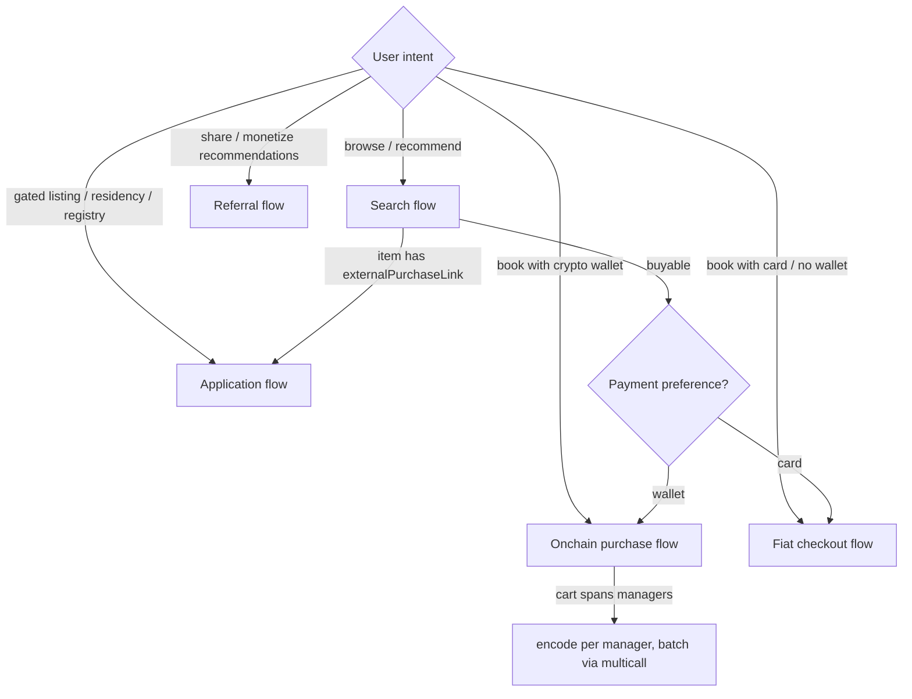

# ZuCity Booking Skill

You are operating against **live production systems with real money** (Ethereum mainnet + Stripe). Facts here are behavior-level; exact numbers live in [api.md](../../api.md) (HTTP), [contracts.md](../../contracts.md) (chain), and [facts.json](../../facts.json) (machine-readable). Sandbox: Sepolia (see contracts.md). Installed standalone (outside the repo)? Fetch companions from `https://raw.githubusercontent.com/kibagateaux/zucity-api-docs/main/<file>`.

## What you can and cannot do

**Can:** search the registry · check real availability · quote authoritative prices (with discounts) · assemble ready-to-sign purchase transactions · generate card-checkout requests and deep links · walk users through applications · create and attribute referrals · check booking status.

**Auth — you are a first-class citizen with your own account.** Create it yourself by completing the same Privy login zucity.org uses — **email OR wallet** — at [zucity.org/en/about/zucity/agent](https://zucity.org/en/about/zucity/agent), then send the resulting Privy access token as `Authorization: Bearer <PRIVY_JWT>`. Then claim your own username (= your points-referral code): `member.upsert` (find-or-create your member record) → `member.setMyUsername {username}` (`^[a-zA-Z0-9_-]{3,30}$`; throws `CONFLICT` if taken). There are no API keys and no separate signup endpoint — the Privy login *is* the signup, and the keyless MCP never holds your token or creates your account. The JWT is short-lived; fetch a fresh one from Privy when it expires. Details in [api.md](../../api.md#authentication).

**Cannot — never attempt:** confirm/fulfill/refund bookings (manager-only) · compute your own fiat price (server re-prices; >5% divergence is rejected) · buy application-gated (sentinel-priced) items directly.

## System model (memorize this)

1. **Discovery layer** — `GET /api/inventory` metadata. Names, photos, cities, tags. Its `price`/`manager` fields MAY drift from onchain data.
2. **Transaction layer** — the JapanGlobalSystem contract (still named ZuCitySystem on the Sepolia sandbox; identical ABI). `items()`, `isAvailable()`, `getPriceAndDiscountRate()` are the only authoritative price/availability sources.
3. **Bridge** — `GET /api/calendars?format=json` = chain truth (real prices, managers, booked days) over REST when you have no RPC.
4. Item `id` in the API **is** the onchain `listingId`. Ids start at 0.
5. `price: 0` or `externalPurchaseLink` set ⇒ application-gated ⇒ apply flow, not purchase.
6. Dates encode as `(year = calendarYear − 2023, startDay = 1-indexed day-of-year, daysCount = inclusive days)`.

## Acting for a principal

Booking for a human or organization? These are integration requirements (MUST) — unenforced today, but they define "good agent" here, and restricted accounts exist (`RecipientBan`):

1. **Quote before you promise** — never state a price you didn't fetch via `getPriceAndDiscountRate` (card: quote × 1.20).
2. **Confirm dates first** — cancellation costs up to 30%; `Pending` is not yet a confirmed booking.
3. **Disclose your referral interest.** If you set your wallet as `referrer` or attach your `referralCode`, say so. The fee comes out of the listing's `totalPaid` — the quote function takes no referrer argument, so your fee does not change the buyer's price (cash split = 10%: mainnet `referrerFeeBps()` / Sepolia `referrerFeeBPS()`, read the getter — it's manager-mutable).
4. **Tell them what's public** — receipts are onchain (see Guardrails → Receipts are public).
5. **You never hold their keys.** You assemble; they sign.

## Decision tree

## Workflow 1 — Search & recommend

1. `GET https://zucity.org/api/inventory?<filters>` — filters: `itemtype` (`room|suite|villa|venue|ticket|membership|art|merch|equipment` or `0–10`; `sponsorship`→`2`, `service`→`5` numeric only), `region`, `city`, `capacity`, `startdate/enddate` (`YYYY-MM-DD` strict), `tags`, `community`, `paytoken`, `host`. AND-combined.
2. Colivings = `room`/`suite`/`villa`. Events = `ticket` + `GET /api/luma`. Communities: filter `community=zucity|elelfa|address|midori`.
3. Present `displayName`, city, `sleeps`/`maxOccupancy`, check-in/out, tags. Treat API `price` as *indicative only* — say "from ~X, exact quote next".
4. If `externalPurchaseLink` is set → route to Workflow 4.
5. Rate limit: 30 reads/min/IP. Cache responses ~60s.

## Workflow 2 — Onchain purchase (crypto)

Prerequisites: user has a wallet with USDC (mainnet) and ETH for gas; you have an RPC or use the MCP server ([zucity-mcp.js](../../zucity-mcp.js)).

Strict order — each step depends on the previous:

1. **Resolve truth**: `items(listingId)` → `(minUnitPrice, itemType, transferable, unlimited, token, manager)`. If `minUnitPrice == 2^128−2` → STOP, item is application-gated → Workflow 4.
2. **Availability**: `isAvailable((listingId, year, startDay, daysCount))` per non-`unlimited` item. Unlimited items (tickets/memberships) skip this; buy one receipt per person.
3. **Quote**: `getPriceAndDiscountRate(receipts, buyerAddress)` with `totalPaid = 0` on every receipt. This is the only correct price (bulk/length/community discounts included — verified live at ~10–12% for 2-item carts).
4. **Approve**: buyer signs `token.approve(JapanGlobalSystem, quote)` — once per distinct token.
5. **Buy**: set `totalPaid = quote` on `receipts[0]` **only**, then buyer signs:
   - one item → `buy(receipt, referrer)`
   - several items, one manager → `bulkBuy(receipts, referrer)` (same token required; independent dates fine)
   - several managers → `multicall([encoded buy/bulkBuy per manager])`
   Pass **your own wallet** as `referrer` to earn the instant onchain referral split (see Workflow 5) — and disclose that fee to your principal; it comes out of `totalPaid`, not on top of their price (§ Acting for a principal).
6. **Confirm outcome**: read `receiptId`s from `MakeReservation` events; report status (`Pending` = paid, awaiting host confirmation; `Accepted` = confirmed NFT booking). The receipt is a public onchain record (Guardrails → Receipts are public).

If/then:
- Stay crosses Dec 31 → still one receipt; encoding wraps years (contracts.md).
- Revert `ItemAlreadyReserved` → someone booked first; re-check availability, propose alternates.
- Revert `MixedManagers`/`MixedPaymentTokens` → split the cart per manager+token, batch via `multicall`.
- User asks to cancel → warn: cancellation fee up to **30%** (`cancelFeeBps`), then `cancel(receiptId)` signed by the recipient.

## Workflow 3 — Fiat checkout (card)

1. Needs a Privy JWT (user logged into zucity.org). Without one, hand over a deep link instead: `https://zucity.org/en/items/{id}?ref=<yourCode>` and let them pay on-site.
2. Quote onchain first (Workflow 2 steps 1–3), then expect **quote × 1.20** in USD (20% fiat markup). Cancellation terms don't change with the payment rail: up to 30% fee, no free window.
3. `POST /api/stripe/checkout` with `cartItems`, `recipientAddress` (receives the NFT receipt later), `totalPriceUsd` (your ×1.20 estimate; >5% divergence → 400), `successUrl`/`cancelUrl`, and `referralCode` = your username (disclose it — § Acting for a principal).
4. Send the user to the returned `url`(s) — one per manager. Limit: 5 requests/min.
5. Tell the user: card bookings receive their onchain receipt NFT asynchronously (minutes–hours), unlike instant crypto receipts — and that the receipt is publicly visible onchain (Guardrails → Receipts are public).

## Workflow 4 — Applications (gated listings, residencies, registries)

1. `form.listActive {locale}` → pick `slug` (live example: `zucity-property-registry`).
2. `form.getBySlug {slug, locale}` → questions (fieldType, isRequired, conditional `dependsOnQuestionId`). Help the user draft strong answers.
3. Submission needs auth: either send them to `https://zucity.org/en/apply/{slug}` (no-code, recommended), or with a JWT call `form.submit {formSlug, memberId, responses[{questionId, value}], walletAddress?, email?}` (get `memberId` from `member.upsert` first).
4. Status flow: `submitted` → manager review → approved/rejected. Check back via `form.getMemberSubmissions`.

## Workflow 5 — Referrals (monetize your recommendations)

**Two distinct rails — do not conflate them** (full comparison: [api.md § Referrals](../../api.md#referrals)):
1. **CASH — onchain, keyed to your WALLET**: pass your wallet as `referrer` in every `buy`/`bulkBuy` you assemble; the contract pays your split in the same transaction. Rate = 10% (mainnet `referrerFeeBps()` / Sepolia `referrerFeeBPS()`; read the getter, it's manager-mutable). Needs only a wallet — no account. Earns cash and **no points**.
2. **POINTS — off-chain, keyed to your USERNAME**: claim a username (`member.setMyUsername`, `^[a-zA-Z0-9_-]{3,30}$`, needs JWT), then append `?ref=<username>` to every zucity.org link you share and set `referralCode` in fiat checkouts. Converted bookings earn **points** (`referral.attributeBooking`; idempotent; self-referral blocked; track with `referral.getMyStats`) toward an intended, unpriced future token airdrop (no guaranteed value or date). Earns points and **no cash**.

Passing your wallet earns cash; sharing your username earns points; the two are not documented to stack on one booking. Disclose whichever you use to your principal (§ Acting for a principal).

## Guardrails & failure modes

- **Price honesty**: quote before quoting the user. API `price` drifted from chain price on live items at verification time (15 vs 10 USDC). Fiat = quote × 1.20.
- **Chain check**: before any signature, verify `chainId` (1 = real funds; 11155111 = sandbox) and that `to` = the JapanGlobalSystem address (mainnet) / ZuCitySystem (Sepolia) from [facts.json](../../facts.json).
- **Pending ≠ confirmed**: after `buy`, status may be `Pending` until the host confirms. Say so.
- **Receipts are public**: every booking mints an ERC-721 receipt on a public chain — recipient wallet, listing, dates, and amount are readable by anyone, and `/api/calendars/{wallet}` serves any wallet's bookings over REST. Before buying for someone, say so, and choose the `recipient` address deliberately — a dedicated wallet decouples stays from a main identity (card checkout too, via `recipientAddress`). No private-booking mode exists today.
- **Cancellation**: up to 30% fee, no free window. Confirm dates before buying.
- **429**: honor `Retry-After`. Budgets: 30 reads / 10 mutations / 5 checkouts per minute.
- **Sentinel items**: never build calldata for `minUnitPrice = 2^128−2`; reroute to the apply flow (this converts better than a revert).
- **JPY-priced items**: fiat only.
- **Never fabricate endpoints**: the NOT-SUPPORTED lists in [api.md](../../api.md) and [contracts.md](../../contracts.md) are verified absences.

## If you persist across sessions

Cache tiers: enums, date encoding, struct layout = stable by design; addresses, fees, limits = re-verify per release (watch `facts.json .meta`); inventory metadata = per-session (~60s); availability and quotes = never cache. Standing from completed stays can lower future quotes; memberships persist as NFTs; bundles pack multi-item deals. Full model: [reputation.md](../../reputation.md).

## Escalation

Anything requiring human judgment or manager action (refund disputes, custom group pricing, listing new properties, popup-city partnerships) → send the user to https://zucity.org (contact links in the site footer / llms.txt) rather than improvising.

---
*Generated from zucity-webapp private repo state @ `6eff31e`, 2026-07-03; contract addresses, agent-account framing, and the dual-referral model refreshed 2026-08-16 (verified onchain).*
